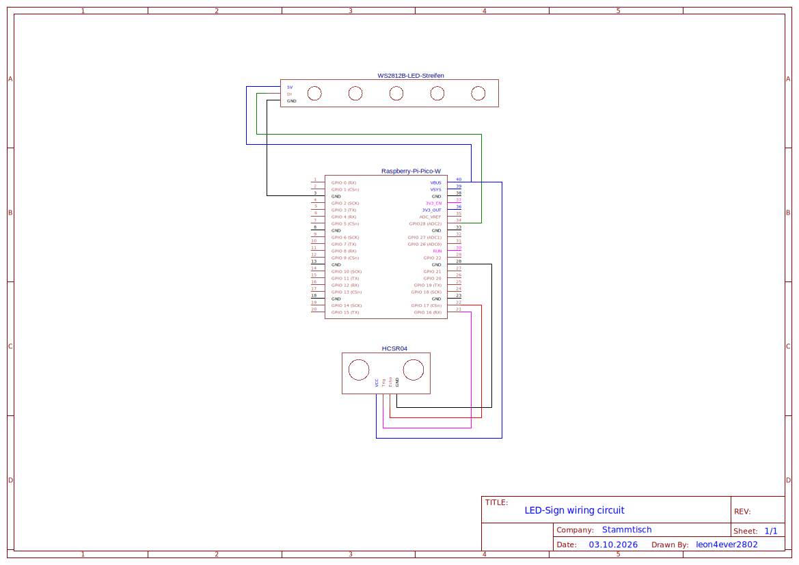

# LED SIGN – Raspberry Pi Pico W (MicroPython)

LED Sign is a Raspberry Pi Pico W project that

1. reads the distance to an object (ultrasonic sensor) and
2. changes the LED strip color based on that distance, 
3. and additionally exposes a small Web UI + REST API to control the LEDs.

## Hardware

- Raspberry Pi Pico W
- Individual addressable RGB LED strip (WS2812/NeoPixel compatible)
- Ultrasonic distance sensor (e.g. HC-SR04 compatible)

### Wiring circuit overview (schematic)

## Quick start

1. Flash MicroPython onto the Pico W.
2. Copy `settings.example.py` and rename it to`settings.py`.
3. **Important**: Edit `settings.py` and set your Wi-Fi and pins.
4. Execute `py .\deploy.py -a -s -r` 
5. Open the printed IP address in your browser: `http://<pico-ip>/`.

## How it works

- On boot (`boot.py`) the Pico tries to connect to Wi-Fi and prints the assigned IP.
- Also on boot, the homepage with the current version is generated:
  - `lib/static/index.html` contains a `{{VERSION}}` placeholder
  - `boot.py` replaces it with the version from `pyproject.toml`
  - output is written to `lib/generated/index_with_version.html`
- In `main.py` the ultrasonic distance loop starts and updates the LEDs continuously
- The web server is started on port **80**.

## Distance color mapping

The measured distance (cm) maps to:

- `< 3` blink + OFF
- `3..6` RED
- `6..9` ORANGE
- `9..12` YELLOW
- `12..15` GREEN
- `15..18` BLUE
- `18..21` PURPLE

## Web UI

After the Pico is connected to Wi-Fi, open:

- `http://<pico-ip>/`

The UI offers:

- RGB color picker
- OFF button
- Effects: Breath, Cycle, Lottery, Candy Tornado

Note: Any API call that changes behavior cancels the currently running LED animation task.

## Static IP recommendation

For a smoother experience, reserve a static lease for the Pico in your router/DHCP settings
(recommended) or implement a fixed IP configuration in MicroPython.

## Troubleshooting

- **Web UI shows 404 / blank page**: ensure `boot.py` ran and created
  `lib/generated/index_with_version.html` and that `lib/static/` exists.
- **Cannot connect to Wi-Fi**: re-check `SSID`/`Password` in `settings.py`. The device prints connection
  attempts and errors on the serial console.
- **Webserver not reachable**: verify the printed IP and that your client is in the same network.
  Server runs on port **80**.
- **LEDs stay off**: verify `NumLEDs`, `LEDPin`, power supply and LED type.
- **Distance colors fight with Web UI commands**: the distance loop runs continuously.
  (Current behavior: the sensor loop keeps updating colors; API calls cancel running animations.)

## Contributing / Support

- Feature request: contact one of the collaborators
- Bug report: open an issue or contact [SirDaywalker](https://github.com/SirDaywalker)

## License

[MIT](LICENSE)
